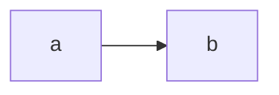

### 타원곡선과 ECC 정의
타원곡선이란 $y^2=x^3+ax+b$ 형태의 방정식(바이어슈트라스 표준형)으로 나타나는 곡선이다. 실수 상에서 타원곡선은 $a$와 $b$가 고정된 실수일 때 방정식 $y^2=x^3+ax+b$를 만족하는 $(x, y)$점들의 집합을 의미한다. 타원곡선은 방정식의 $a$, $b$ 값에 따라서 다양한 형태를 가진다.

타원곡선은 타원처럼 생기지는 않았지만 타원의 둘레를 구하기 위한 적분에서 유래한 이름이다.

타원곡선 암호(Elliptic Curve Cryptography, ECC)란 타원곡선 이산대수 문제의 어려움에 기반한 암호이다. RSA와 같은 공개 키 암호에 비해서 짧은 키 길이(RSA 1024비트, ECC 160비트)와 빠른 연산속도를 가지지만 그와 동등한 수준의 보안 강도를 가진다. 이러한 특징 때문에 계산 능력이 뛰어나지 않은 장치에서 사용하기에 적합하며 현재 비트코인 소유권 증명, 애플 DNS 정보 암호화 등에 사용된다.

### GF 상에서 타원 곡선의 덧셈 연산
유한체는 그 원소의 수가 유한하다. 이 때문에 유한체를 만들기 위해 modular 연산을 이용하며, $\mod p$에서 $p$는 소수로 정의한다. 

$$
\text{Let } p>3, a, b \in Z_p, 4a^3 + 27b^2 \neq0(\mod p)
$$

$$
E=\{ (x, y)\in Z_p*Z_p | y^2\equiv x^3ax+b(\mod p)\}\cup\{O\}
$$

$E : y^2=x^3+x\text{ over } Z_{23}(p=23)$인 유한체를 예로 들면 $x=9$일 때 $y^2=738 \mod 23 = 2$이므로 $y=5$가 될 수 있다. 여기서 $p$가 커지면 $y$를 찾는 것이 어렵기 때문에 안정성을 갖는다.

유한체 상에서의 덧셈은 다음과 같이 정의한다.

위 그림에서 점P와 Q를 지나는 직선이 타원곡선과 만나는 또 다른 점을 K'이라고 하면 이를 x축에 대하여 대칭이동한 점K를 P+Q=K로 정의한다. 이렇게 덧셈 연산을 정의하면 다음과 같은 성질을 가진다.

1. 덧셈에 대한 닫힘
점P와 Q가 타원곡선 위에 있을 때 P+Q 또한 타원곡선 위에 존재한다.

2. 항등원의 존재
타원곡선 위의 임의의 점P에 대해 P+O=P를 만족시키는 무한원점 O가 존재한다.

3. 덧셈의 교환법칙, 결합법칙
타원곡선 상의 덧셈에 대해 교환법칙과 결합법칙이 성립한다.

4. 역원의 존재
모든 점 P에 대해 -P가 존재하고 P+(-P)=O가 성립한다.

타원곡선 상에서의 덧셈의 다음의 3가지 경우로 구분할 수 있다.

1. R=P+Q

$$
\lambda={(y_2-y_1)\over(x_2-x_1)}
$$

$$
x_3=\lambda^2-x_1-x_2, y_3=\lambda(x_1-x_3)-y_1
$$

2. R=P+P

$$
\lambda={(3x_1^2+a)\over{2y_1}}
$$

$$
x_3=\lambda^2-2x_1, y_3=\lambda(x_1-x_3)-y_1
$$

3. O=P+(-P)
이 경우에는 교점이 무한대에 있으며, 그 점을 O라고 하고 무한원점이라고 한다. 이는 곧 이 군에서의 덧셈에 대한 항등원이다.

### 키 생성
비밀키 $d$는 난수 생성기를 이용해서 $p$보다 작은 소수로 정한다. 공개키 $Q$는 $Q(x, y)=d\times G$로 생성하며 여기서 $G$는 타원곡선 상의 임의의 점이고 $d\times G$는 $G$를 $d$번 더한 값을 의미한다.
이 과정에서 $d$와 $G$로 $Q$를 구하는 것은 쉽지만 $G$와 $Q$를 알 때 $d$를 구하는 것은 어렵다. 이를 ECDLP(Elliptic Curve Discrete Logarithm Problem)라고 하며 이와 같은 성질 때문에 공개키 암호 기술로 사용할 수 있다.

여기서는 $y^2=x^3+x+6\text{ over }Z_{11}$에서 $G=(2,7)$이라고 하여 키 생성, 암호화와 복호화를 진행한다.

$$
\lambda={ {3*2^2+1}\over{2*7}}={13\over14}={13\mod 11\over14\mod 11}=2*3^{-1}=2*4=8\mod 11
$$

$\lambda$ 식을 계산할 때 확장된 유클리드 알고리즘을 이용할 수 있다.

$$
x_2=8^2-2*2=5\mod 11
$$

$$
y_2=(2-5)*8-7=2\mod 11
$$

따라서 $2G=(5, 2)$이며 이 과정을 반복해서 $G, 2G, \dots, kG$까지 구할 수 있으며 이는 다음과 같다.

| $k$  | 1      | 2      | 3      | 4       | 5      | 6     | 7     | 8      | 9       | 10     | 11     | 12    |
| ---- | ------ | ------ | ------ | ------- | ------ | ----- | ----- | ------ | ------- | ------ | ------ | ----- |
| $kG$ | (2, 7) | (5, 2) | (8, 3) | (10, 2) | (3, 6) | (7,9) | (7,2) | (3, 5) | (10, 9) | (8, 8) | (5, 9) | (2,4) |

### 암호화
전송하려는 평문을 $x(10, 9)$라고 하고 비밀키를 $pk=7$, 난수 $k=3$이라고 하면 암호화 공식은 다음과 같다.

$$
\beta=pk\times G=7G
$$

$$
y_1=k\times G=3G
$$

$$
y_2=x+k\times\beta=(10, 9)+3\times7G
$$

$$
\therefore e_k(x, k)=(kG, x+k\beta)
$$

이렇게 암호화된 $e_k(x, k)=(kG, x+k\beta)$를 전송한다.

### 복호화
$x=y_2-(pk\times y_1)$의 공식으로 복호화를 할 수 있다.

